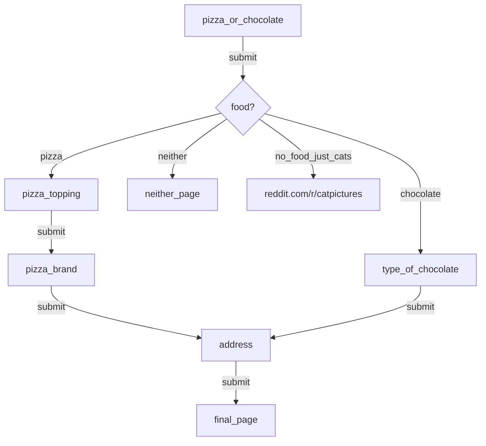

# The example form

The configuration for the example form can be found in `app/forms/config/example-form.yml`.

The flow is:

```mermaid
flowchart TD
    pizza_or_chocolate -->|submit| food{food?}
    food -->|pizza| pizza_topping
    food -->|chocolate| type_of_chocolate
    food -->|neither| neither_page
    food -->|no_food_just_cats| reddit.com/r/catpictures
    pizza_topping -->|submit| pizza_brand
    pizza_brand -->|submit| address
    address -->|submit| final_page
    type_of_chocolate -->|submit| address
```
